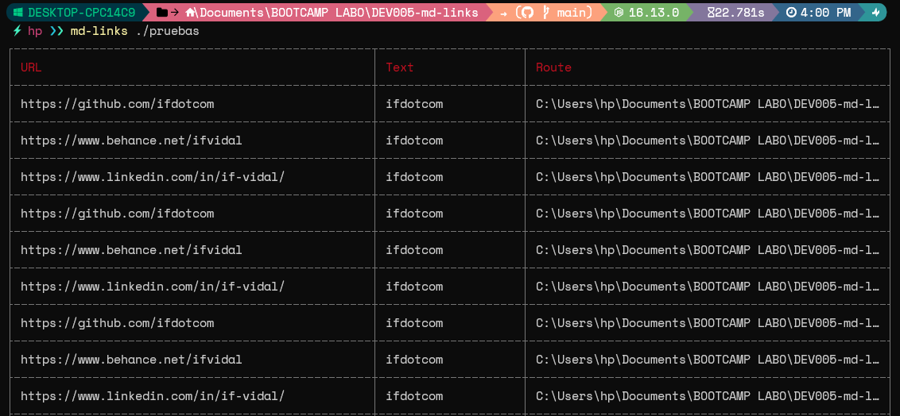
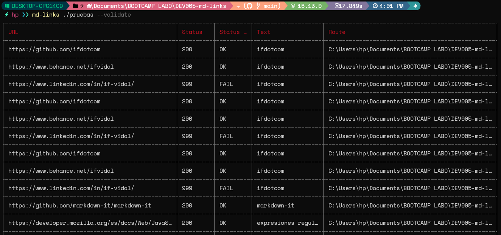
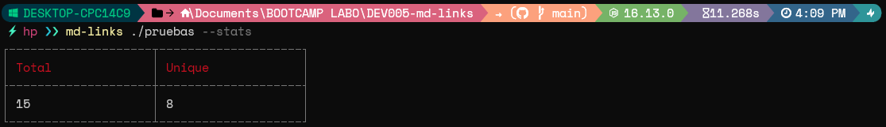
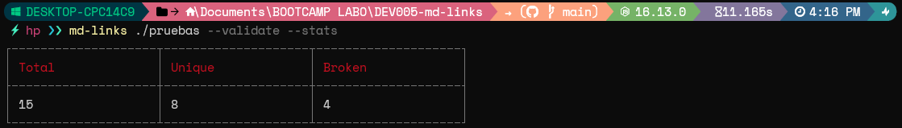

## Indice

- [Indice](#indice)
- [1. MDLINKS](#1-mdlinks)
- [2. Instalación](#2-instalación)
- [3. Casos de uso](#3-casos-de-uso)
- [4. MDLINKS como módulo](#4-mdlinks-como-módulo)
- [5. Desarollo](#5-desarollo)

## 1. MDLINKS

---

mdLinks es una poderosa librería diseñada para extraer enlaces de archivos Markdown (MD) y proporcionar estadísticas útiles sobre esos enlaces. Con esta herramienta, los desarrolladores pueden automatizar la tarea de encontrar enlaces en archivos MD y obtener información valiosa sobre ellos de manera rápida y eficiente.
Al utilizar mdLinks, los usuarios pueden pasar una ruta o un directorio como argumento y la librería buscará todos los archivos con extensión .md dentro de la ruta especificada.
Una vez que los archivos MD son identificados, mdLinks extrae los enlaces contenidos en cada archivo y devuelve una tabla con información detallada sobre cada enlace. Esta información incluye la URL del enlace, el texto de anclaje y la ruta del archivo en el que se encuentra.
Además de la extracción de enlaces, mdLinks ofrece estadísticas útiles sobre los enlaces encontrados. Proporciona el número total de enlaces encontrados, así como el número de enlaces únicos, es decir, aquellos que no se repiten.
mdLinks también ofrece la capacidad de verificar el estado de cada enlace extraído. Puede detectar enlaces rotos, es decir, aquellos que conducen a páginas web no disponibles o que devuelven un código de error.

## 2. Instalación

---

```bash
  npm i ifdotcom-mdlinks
```

## 3. Casos de uso

---

**Caso 1**

```bash
  md-links <path-to-file-or-directory>
```

_Valores de retorno:_

- **href**: URL encontrada.
- **text**: Texto que aparecía dentro del link.
- **file**: Ruta del archivo donde se encontró el link.

_Caso 1 | Ejemplo_


---

**Caso 2**

```bash
  md-links <path-to-file-or-directory> --validate
```

or

```bash
  md-links <path-to-file-or-directory> -v
```

_Valores de retorno:_

- **href**: URL encontrada.
- **text**: Texto que aparecía dentro del link.
- **file**: Ruta del archivo donde se encontró el link.
- **status**: Código de respuesta HTTP.
- **statusText**: Mensaje fail en caso de fallo u ok en caso de éxito.

_Caso 2 | Ejemplo_


---

**Caso 3**

```bash
  md-links <path-to-file-or-directory> --stats
```

or

```bash
  md-links <path-to-file-or-directory> -s
```

_Valores de retorno:_

- **total**: Links encontrados.
- **unique**: Links que no se repiten.

_Caso 3 | Ejemplo_


---

**Caso 4**

```bash
  md-links <path-to-file-or-directory> --validate --stats
```

or

```bash
  md-links <path-to-file-or-directory> -v -s
```

_Valores de retorno:_

- **total**: Links encontrados.
- **unique**: Links que no se repiten.
- **broken**: Links que no son válidos.

_Caso 4 | Ejemplo_


---

## 4. MDLINKS como módulo

---

Además, tienes la opción de importar el módulo de una forma alternativa:

```bash
    const mdlinks = require("ifdotcom-mdlinks").mdLinks;

    mdlinks('<path-to-file-or-directory>',{validate: false, stats: false})
    .then((res)=>{
        console.log(res)
    })

```

## 5. Desarollo
- Planificación | [GitHub Projects](https://github.com/users/ifdotcom/projects/1)
- Diagrama de flujo | [Diagrama de Flujo](https://user-images.githubusercontent.com/65190924/237469670-39c6c64b-ef9e-45c8-b0ba-f075f445d529.png)
